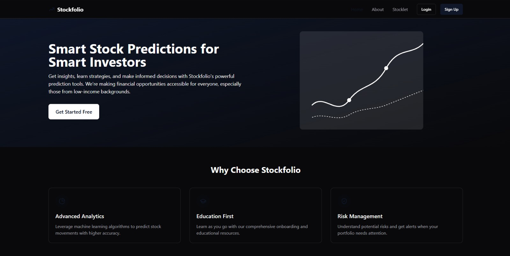

# 📈 StockFolio

StockFolio is a stock market educational and prediction platform designed to make financial knowledge and investment tools accessible to everyone, especially beginners and low-income individuals.

## 🚀 Features

- 📚 Interactive Learning Modules to teach the basics of finance, investing, and avoiding scams.
- 📊 Real-time Stock Dashboard with MA100 & MA200 visualizations.
- 🌐 React Frontend with secure login and progress tracking.
- 🔒 Learning module completion gate before dashboard access.
- 🌱 Focused on SDG Goal 1: No Poverty.

## 🖼️ UI Preview

### 🏠 Homepage



### 📚 Learning Modules


### 📊 Dashboard - MA 100 & MA 200


### 🤖 AI Chatbot


## 🧠 How It Works

1. User signs up and logs in.
2. Completes basic financial education modules.
3. Gains access to the dashboard and prediction tools.
4. Enters stock ticker and sees real-time price charts with moving averages.

## 🛠️ Tech Stack

- **Frontend:** React.js, Tailwind CSS
- **Backend:** Flask
- **Authentication:** Basic login flow (can be expanded with Firebase/Auth0)
- **Hosting:** Localhost / Streamlit Cloud / Vercel

## 🚀 How to Run the Project

```bash
# Clone the repository
git clone https://github.com/your-username/your-repo-name.git
cd your-repo-name
```

# Start the frontend (React)
```
cd frontend
npm install
npm run dev
```

# In a new terminal, start the backend (Flask)

```
cd backend
pip install -r requirements.txt
python app.py
```


## 👥 Contributors

This project is built with the goal of spreading financial literacy and enabling safer stock market access. It's beginner-friendly, cleanly designed, and centered around **SDG Goal 1: No Poverty**.

- Alvi A V  
- Minhaj Noushad  
- John Antony

